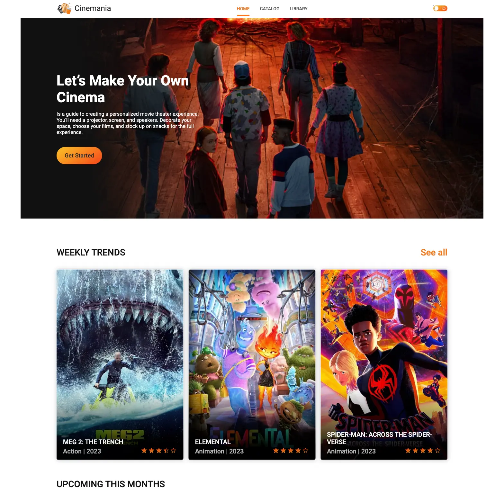

# Cinemania

🎞Cinemania📽 is the ultimate destination for all things movies, providing you
with comprehensive information and keeping you in the loop with the latest news🗞
from the cinematic world✅.

## Table of Contents

- [Description](#description)
- [Technologies Used](#technologies-used)
- [My Role](#my-role)
- [Key Features](#key-features)
- [Achievements](#achievements)
- [Getting Started](#getting-started)
- [Usage](#usage)

## Description

Cinemania is your go-to platform for all things related to movies. Whether
you're looking for information on films, checking out trailers, or building your
own curated movie library, Cinemania has got you covered. With its multi-page
structure, you can seamlessly navigate through various sections to find exactly
what you want.

## Technologies Used

We used the following technologies to create an interesting and responsive
website:

- HTML
- SCSS (Sass)
- JavaScript

To optimize our project, we used Parcel to combine and optimize resources, thus
ensuring top-notch performance.

## My Role

As a technical lead and developer, I focused primarily on the technical aspects
of the project. I was actively involved in the planning, architecture, and
implementation of key functionalities. In addition, I played an important role
in ensuring the smooth development of the interface. In particular, I was
responsible for

- Creating the "My Library" page for managing saved movies.
- Implementing functionality for adding and removing movies from the library.
- Developing the logic for displaying a modal window with movie information.

## Key Features

- **Movie Search**: Users can easily search for their favorite movies.
- **Watch Trailers**: Movie trailers can be watched directly on the website.
- **Personal Library**: Users can save movies to their library.
- **Modal Window**: The interactive modal window provides detailed movie
  information.

## Achievements

Throughout the project, I demonstrated:

- Strong technical leadership, guiding the team to effectively solve problems
  and optimize code.
- Successful implementation of modal window functionality that improves user
  experience and interaction.
- Developed key features for managing the user's movie library, ensuring
  seamless organization and customization.

Thanks to my technical guidance and contribution to the development, Cinemania
has evolved into a feature-rich platform that delights users and simplifies
their journey into the world of cinema and simplifies their discovery.

## Getting Started

To get started with Cinemania, follow these steps:

1. Clone the repository:
   `git clone https://github.com/your-username/cinemania.git`
2. Navigate to the project folder: `cd cinemania`
3. Make sure you have the LTS version of Node.js installed on your computer.
   [Download and install](https://nodejs.org/en/) it if needed
4. Install dependencies: `npm install`
5. Start the development server: `npm start`
6. Open your web browser and go to
   [ http://localhost:5173/](http://localhost:1234/). The page will
   automatically refresh whenever you save changes to project files.

## Usage

Feel free to explore the website's pages, animations, and responsive design. You
can also use this project as a reference for implementing similar features in
your projects.
